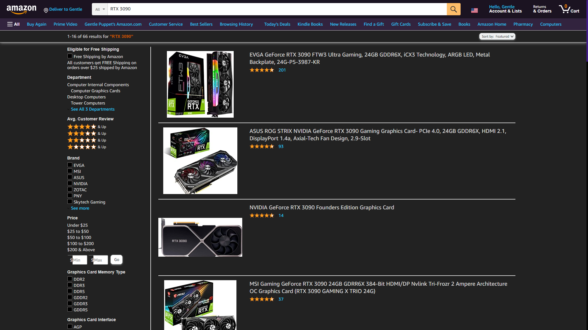

# Gentle's Darkmode Amazon UserScript

## Description:
This is a simple Userscript that makes amazon darkmoded. It can be a bit buggy here and there but I try to updaate it when needed. It works for the most part.

As long as you have a userscript extension like Tampermonkey or Greasemonkey then clicking the link below will install the script for you.
* [Install Darkmode Amazon](https://github.com/GentlePuppet/Gentles_Tampermonkey_Userscripts/raw/main/Amazon%20Darkmode/Amazon%20Darkmode.user.js)

### Don't have a userscript extension?
* [Get Tampermonkey for Chrome](https://chrome.google.com/webstore/detail/tampermonkey/dhdgffkkebhmkfjojejmpbldmpobfkfo?hl=en)
* [Get Tampermonkey for Firefox](https://addons.mozilla.org/en-US/firefox/addon/tampermonkey/)
