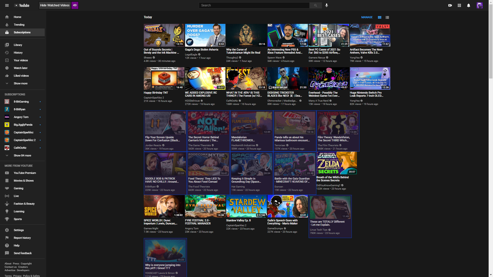
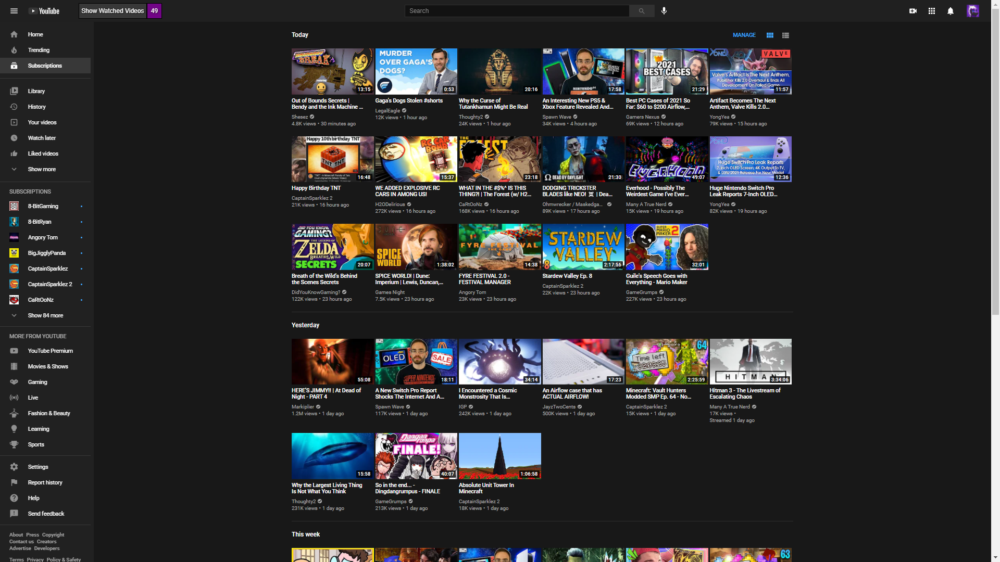

# Gentle's Youtube Hide Watched Videos

## Description:
This is a simple Userscript that adds a toggle to hide/show watched videos.

As long as you have a userscript extension like Tampermonkey or Greasemonkey then clicking the link below will install the script for you.
* [Install Youtube Hide Watched Videos](https://github.com/GentlePuppet/Gentles_Tampermonkey_Userscripts/raw/main/Youtube%20Hide%20Watched%20Videos/Youtube%20Hide%20Watched%20Videos.user.js)

### Don't have a userscript extension?
* [Get Tampermonkey for Chrome](https://chrome.google.com/webstore/detail/tampermonkey/dhdgffkkebhmkfjojejmpbldmpobfkfo?hl=en)
* [Get Tampermonkey for Firefox](https://addons.mozilla.org/en-US/firefox/addon/tampermonkey/)
