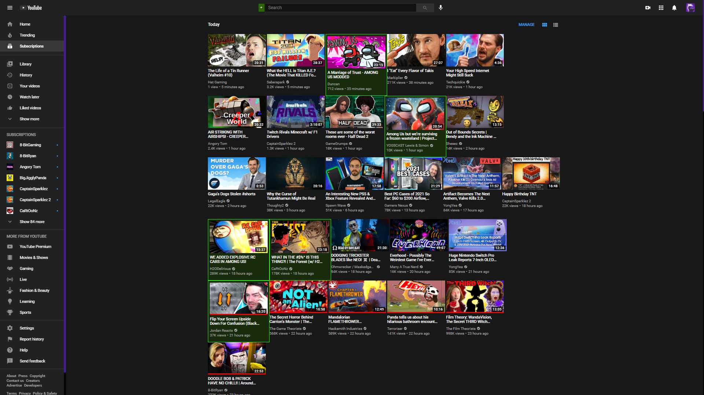

# Gentle's Youtube Highlight Videos

## Description:
* This is a simple Userscript that adds a filter to highlight videos.
* There is a + button that lets you configure the filter list. 
* To hightlight channels simply add "by CHANNELNAME" to the filter.
* To remove filters hold shift and click on the + button.

As long as you have a userscript extension like Tampermonkey or Greasemonkey then clicking the link below will install the script for you.
* [Install Youtube Highlight Videos](https://github.com/GentlePuppet/Gentles_Tampermonkey_Userscripts/raw/main/Youtube%20Highlight%20Videos/Youtube%20Highlight%20Videos.user.js)

### Don't have a userscript extension?
* [Get Tampermonkey for Chrome](https://chrome.google.com/webstore/detail/tampermonkey/dhdgffkkebhmkfjojejmpbldmpobfkfo?hl=en)
* [Get Tampermonkey for Firefox](https://addons.mozilla.org/en-US/firefox/addon/tampermonkey/)
